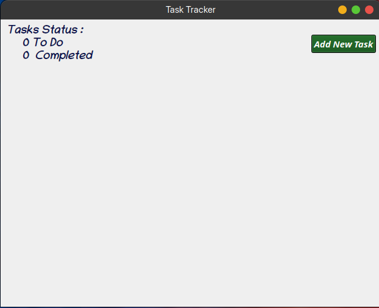
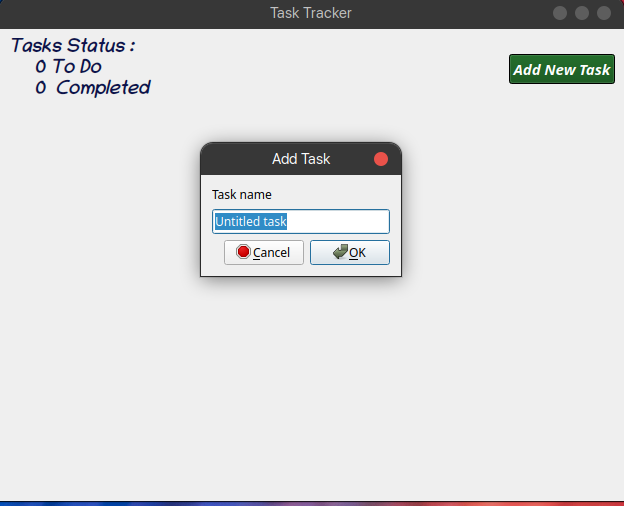
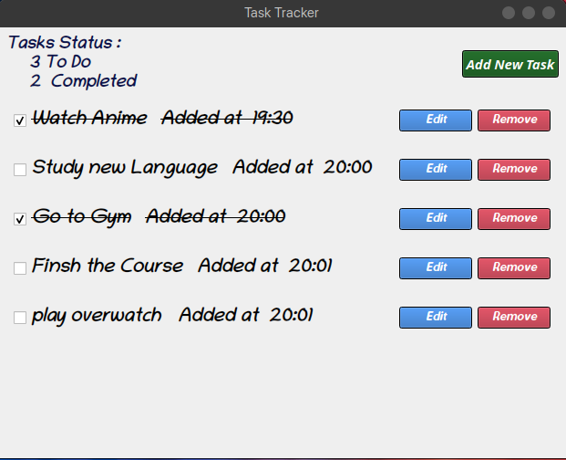

# Task-Tracker GUI

Task-Tracker GUI is a lightweight and intuitive task management application built with C++ and Qt. Designed specifically for Linux, it provides a simple way to add, edit, and track your daily tasks through a clean graphical interface.

<!-- Image preview of the main interface -->


## Features

- **User-Friendly Interface:** A clean, modern UI for easy task management.
- **Task Operations:** Quickly add, modify, and delete tasks.
- **Priority & Status Indicators:** Assign priorities and monitor task progress at a glance.
- **Category Organization:** Organize tasks into custom categories to suit your workflow.
- **Optimized for Linux:** Efficient performance tailored for Linux environments.

<!-- Another image preview showing task management in action -->


## Pre-Built Binary

For convenience, a pre-compiled version of Task-Tracker GUI is available on the [GitHub Releases page](https://github.com/AbdelrahmanElshahat/Task-Tracker-Gui/releases). Download the release corresponding to your system and start tracking your tasks immediately—no need to build from source.

## Prerequisites

If you prefer to build the application from source, ensure you have the following installed:

- **Qt Framework:** Version 5.12 or later (or Qt 6, depending on your setup).
- **C++ Compiler:** Compatible with your chosen version of Qt.
- **Qt Creator (Optional):** For an integrated development experience.

## Installation & Building

Follow these steps to build the application from source:

1. **Clone the Repository:**

   ```bash
   git clone https://github.com/AbdelrahmanElshahat/Task-Tracker-Gui.git
   cd Task-Tracker-Gui
    ```

2. **Checkout the Release Tag (v1.0.0):**

   ```bash
   git checkout tags/v1.0.0
   ```

3. **Open the Project:**

   - **Launch Qt Creator.**
   - **Open the project by selecting the .pro file located in the repository root.**
4. **Build the Project:**

   - **Select the build configuration (e.g., Debug or Release).**
   - **Click the build button to compile the application.** 
5. **Run the Application:**

    - **Once the build is complete, run the application directly from Qt Creator or execute the generated binary.**

## Usage

After launching Task-Tracker GUI, you can:

- **Add a Task: Use the interface to enter a new task, set its priority, and assign it to a category.**
- **Edit/Delete a Task: Click on any existing task to modify or remove it.**
- **Monitor Progress: Use visual indicators to track your tasks’ statuses and priorities.**



## Contributing

Contributions are welcome! If you have ideas for improvements, bug fixes, or new features, please feel free to:

1. **Fork the Repository**
2. **Create a new branch for your feature or fix.**
3. **Submit a pull request with a detailed explanation of your changes.**

For major changes, please open an issue first to discuss what you would like to change.

## Reporting Issues

If you encounter any issues or have suggestions, please open an issue on the[GitHub Issues](https://github.com/AbdelrahmanElshahat/Task-Tracker-Gui/issues).

## License

This project is licensed under the MIT License - see the [LICENSE](LICENSE) file for details.
